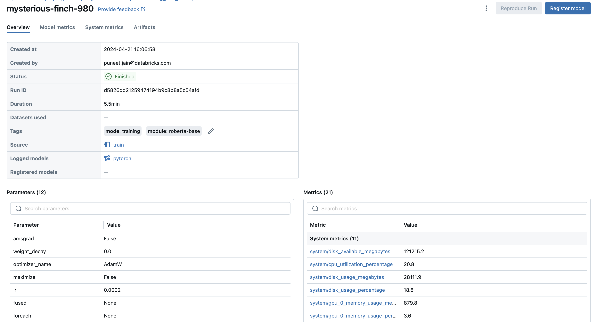

# 🔥 Fine-tune Your Transformer model With PyTorch Lightning and MLFlow for Tracking

## Introduction

Processes and information are at the heart of every business. The vulnerability and
opportunity of this moment is the question of whether your business can automate your
processes using AI, and reap the rewards of doing so. ChatGPT, a general purpose AI, has
opened our eyes to what AI can do. What matters now is directing the power of AI to *your*
business problems and unlocking the value of *your* proprietary data. 

## Table of Contents

1. [Overview of LLM Fine Tuning](#1-overview-of-llm-fine-tuning)
2. [Problem Background](#2-problem-background)
3. [Architecture of the AI System](#3-architecture-of-the-ai-system)
4. [Code Deep Dive](#4-code-deep-dive)
5. [Installation and Quick Start](#5-installation-and-quick-start)
6. [References](#6-references)

## 1. Overview of LLM Fine Tuning

You don't want an AI that just can chat; what you really want are automations that perform
the work that keeps your business running--powering through business processes at
great accuracy and scale. The proven way to customize AI to your business
processes is to fine tune an LLM on your data and on the action you want AI to perform.

Let's talk specifically about the fine tuning that we are going to do in this document
and the technology behind it. Listed below are the three tools we will use extensively:

- **PyTorch Lightning** (gives us just enough control without excessive boilerplate)
- **Hugging Face** (access to thousands of community-maintained models)
- **MLflow** (for tracking results and checkpointing weights during the process of fine tuning)

At the end, you should take away two things from this document:

- How to build deep learning models that attain state-of-the-art results
- How the experience of building such models can be pretty easy when you have the write tracking and logging software to streamline the development process


## 2. Problem Background

In today’s world, it’s hard to find a service, platform, or even a consumer good that doesn’t have a legally-binding terms of service connected with it. These encyclopedic size agreements, filled with dense legal jargon and sometimes baffling levels of specificity, are so large that most people simply accept them without reading them. However, reports have indicated over time that occasionally, some suspiciously unfair terms are embedded within them.

Addressing unfair clauses in Terms of Service (TOS) agreements through machine learning (ML) is particularly relevant due to the pressing need for transparency and fairness in legal agreements that affect consumers. Consider the following clause from an example Terms of Service agreement: "We may revise these Terms from time to time. The changes will not be retroactive, and the most current version of the Terms, which will always..." This clause stipulates that the service provider may suspend or terminate the service at any time for any reason, with or without notice. Most people would consider this to be quite unfair. 


Let's design how we're going to do it.

## 3. Architecture of the AI System


The architecture outlines the workflow for fine-tuning a language model. It begins with a fine-tuning job that loads data and uses Hugging Face (HF) libraries to Fetch pre-trained models and wraps them in a lightening Module. Metrics and checkpoints are logged at each step with MLflow. Finally, a checkpoint is loaded to run inference.




## 4. Code Deep Dive

###### TODO to update link once MLFLow Blog is published

## 5. Installation and Quick Start

**Step 1.** Clone this repository into a local working directory:

```sh
git clone https://github.com/puneet-jain159/deeplearning_with_mlfow
```

**Step 2.** We recommend using Jupyter Notebook for its ability to install all dependencies at runtime and to execute magic commands. For installation guidance, please refer to the [Jupyter installation documentation](https://jupyter.org/install) . Additionally, all project dependencies are listed in `requirements.txt`; you can create a virtual environment for these instead of using IPython.


**Step 3.** Using IPython/Jupyter Notebook, simply run the `train.ipynb`. you can use to command to execute from terminal 

```sh
jupyter nbconvert --execute train.ipynb
```


## 5. References
1. [Build Your Custom AI/LLM With PyTorch Lightning](https://medium.com/@jz77/build-your-custom-ai-llm-with-pytorch-lightning-4eeb943dd88a)
2. Ilias Chalkidis, Abhik Jana, Dirk Hartung, Michael Bommarito, Ion Androutsopoulos,
Daniel Martin Katz, Nikolaos Aletras. (2021). *LexGLUE: A Benchmark Dataset for Legal
Language Understanding in English*. Retrieved from arXiv: https://arxiv.org/abs/2110.00976